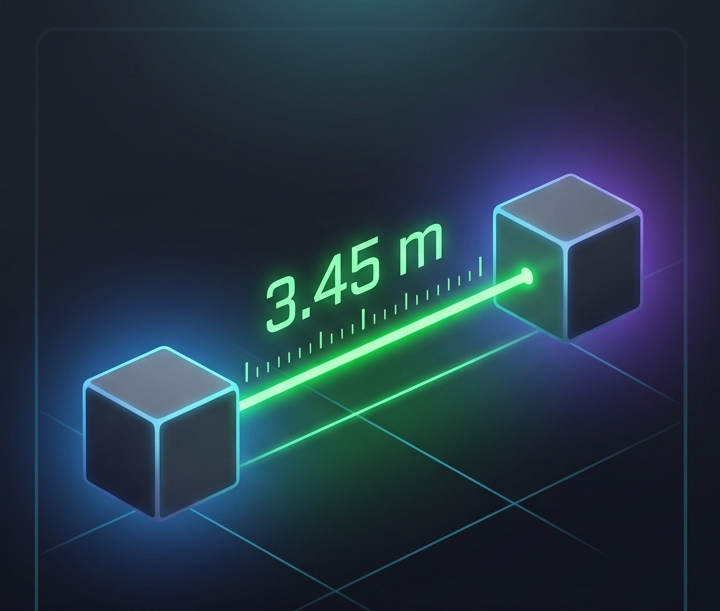
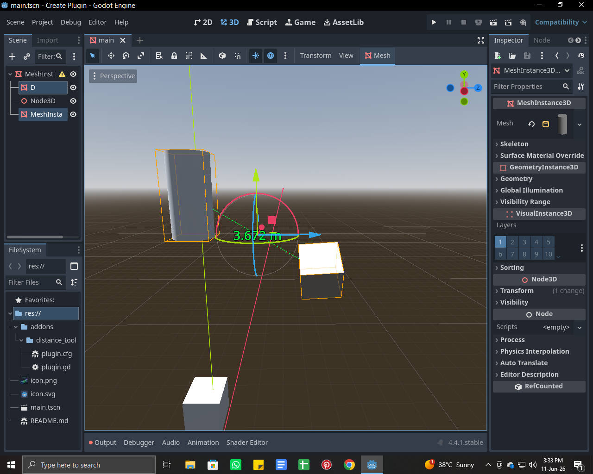
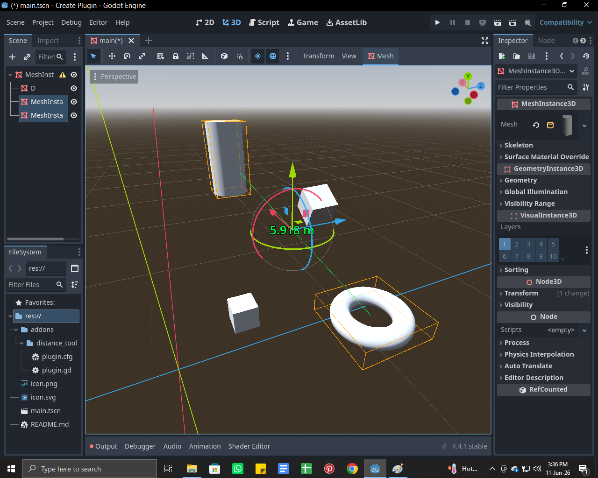

# Distance Measure Plugin for Godot 4

A lightweight and easy-to-use Godot 4 editor plugin that lets you measure the distance between two selected 3D objects directly inside the editor.

<video src="video.mp4" width="100%" controls muted></video>

## ✨ Features

- 📐 Measure distance between two Node3D objects
- 🎯 Visual distance line in the 3D viewport
- 🏷️ Distance displayed as a 3D label
- ⚡ Works directly inside the Godot Editor
- 🛠️ Useful for level design and object placement
- 🎮 Designed for Godot 4.x

## 📋 Requirements

- Godot 4.x

## 📦 Installation

1. Download or clone this repository.
2. Copy the plugin folder into your project's `addons` directory.

```text
addons/
└── distance_measure/
```

3. Open your Godot project.
4. Navigate to:

```text
Project → Project Settings → Plugins
```

5. Enable **Distance Measure Plugin**.

## 🚀 How to Use

1. Enable the plugin.
2. Select two `Node3D` objects in your scene.
3. The plugin automatically calculates the distance between them.
4. A measurement line and distance label will appear in the 3D viewport.

## 🎯 Use Cases

- 🏗️ Level Design
- 🌍 Environment Creation
- 🏠 Architectural Visualization
- 📍 Precise Object Placement
- 🔍 Scene Inspection & Debugging

## 📸 Screenshots

Add screenshots or GIFs here:

## 📸 Screenshots






## 🤝 Contributing

Contributions, bug reports, and feature requests are welcome!

## 📄 License

Released under the MIT License.

## 👨‍💻 Author

**M.Osaid Aliy**

Made with ❤️ for the Godot community.
````
